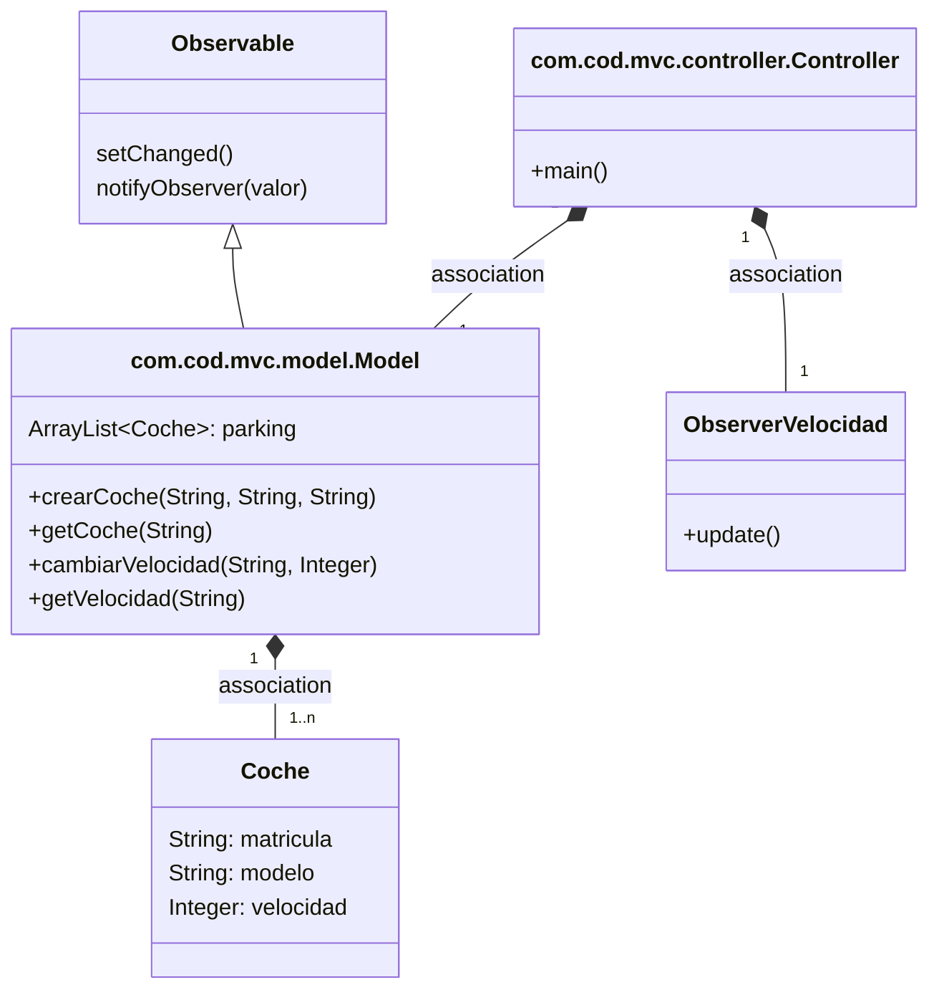
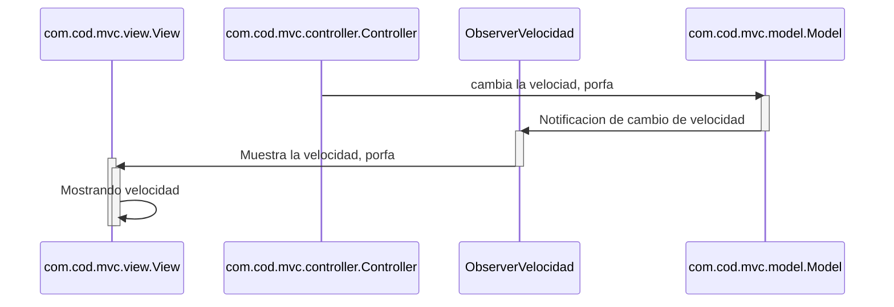
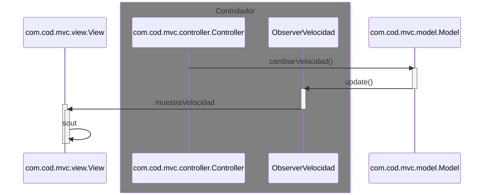
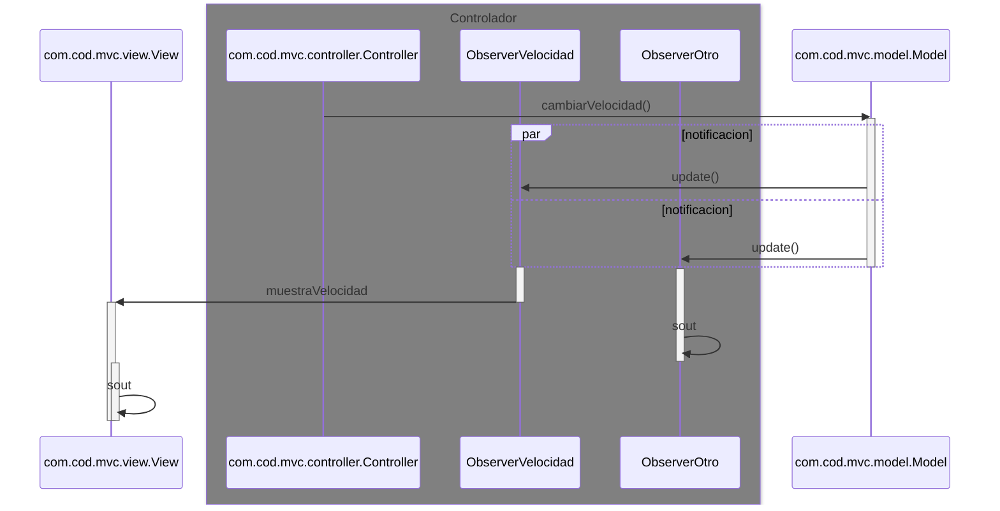

# Arquitectura MVC con Observer

En esta rama utilizaremos el patrón Observer

Los cambios de la velocidad que se hagan en el model
serán observados por el com.cod.mvc.controller.Controller

Para notificar a los observadores hacemos dos pasos

* Actualizamos el estado a 'algo a cambiado' con `setChanged()`
* Notificamos a los observadores `notifyObservers(valor)`

De esta manera se *dispara* en todos los observadores el método `update()`

---
## Diagrama de clases:

---

## Diagrama de Secuencia

Que ocurre cuando se cambia la velocidad

El mismo diagrama con los nombres de los métodos

Si sumamos otro observador, entonces el `update()` será en paralelo (**par**)

a todos los Observadores

---
## Pasos para la configuración

1. com.cod.mvc.model.Model
   * Extender `Observable` en `com.cod.mvc.model.Model`
   * En el método en donde ocurra el cambio:
     * setChenged()
     * notifyObserver(valor)
2. Crear una clase que sea el observador, que implementa la interface `Observer`
    * definir el método `update()`
3. com.cod.mvc.controller.Controller
    * Instanciar el observer, definido en el punto anterior
    * Añadir este observer al observable con `addObserver()`
