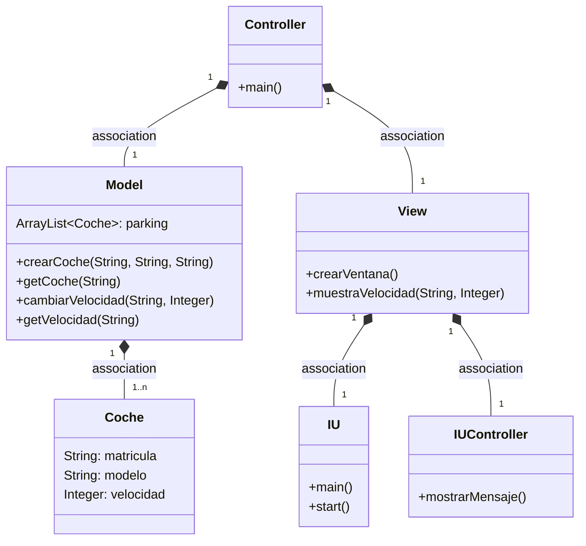
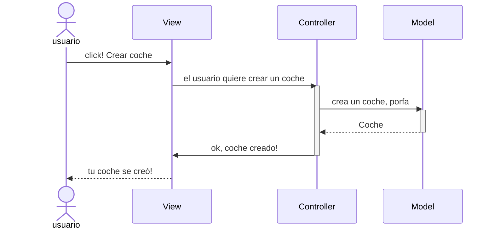
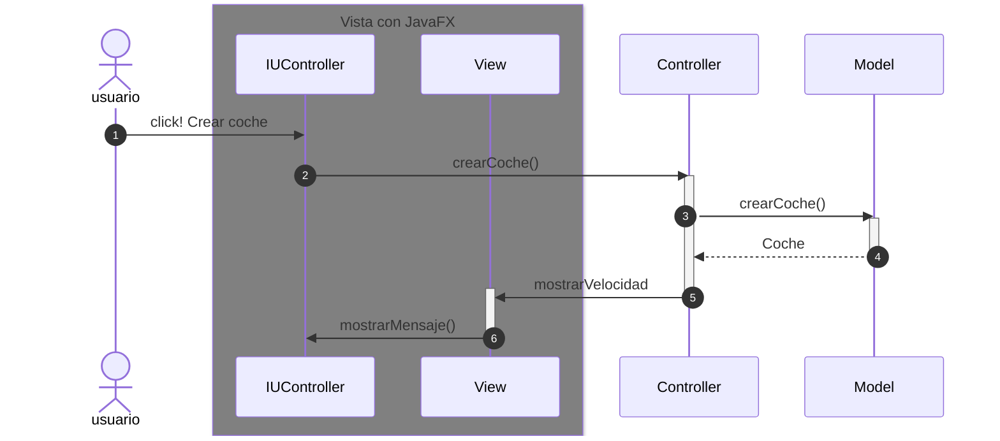

# Arquitectura MVC

Aplicación que trabaja con objetos coches, modifica la velocidad y la muestra

---

En esta rama está añadido los eventos en la IU

En vez de usar `swing`, usaremos [`javafx`](https://openjfx.io/)

De esta manera vemos lo independiente que queda la interfaz gráfica, pudiendo migrarla sin tener que modificar el resto de la App

Mantendremos una estructura básica de javafx

El Model y el Controller no cambian

---
### Diagrama de clases:

---

## Evento en el View

Cuando ocurre un evento en la vista, el `controller` se tiene que enterar.
Tenemos que tener en cuenta que en el MVC estricto, la vista no se comunica con el modelo.

En el listener del botón llamamos al `controller`

Ahora la parte de la Arquitectura de la vista, son las clases de JavaFX
