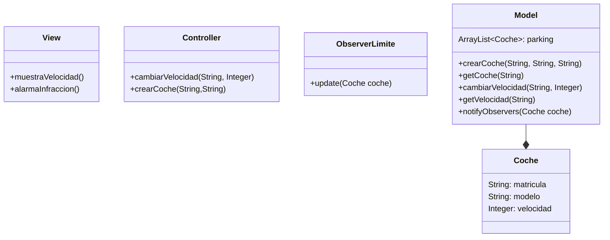
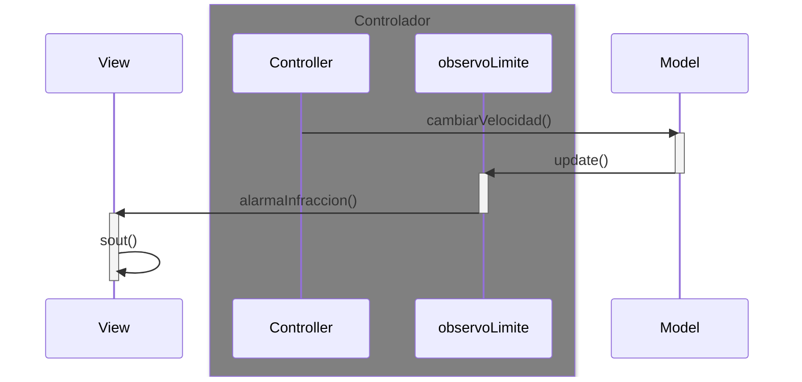

# Arquitectura MVC con Observer

En esta rama utilizaremos una versión muy simplificada del patrón Observer

Los cambios de la velocidad que se hagan en el model

serán observados por una clase `ObserverLimite`

Esta clase seerá la encargada de controlar el exceso de velocidad

* Notificamos a los observadores `notifyObservers(valor)`

* se *dispara* en todos los observadores el método `update()`

---
## Diagrama de clases:

---

## Diagrama de Secuencia

Que ocurre cuando se cambia la velocidad

Observador (que vigile el limite de velocidad), entonces se lanza el `update()` 

---
## Pasos para la configuración

1. Model
   * En el método donde ocurre un cambio de velocidad, añadir la llamada a `notifyObservers(coche)`
2. Desarrollar el metodo `notifyObservers(coche)` en el modelo
    * Este método recorrerá la lista de observadores y llamará al método `update()` de cada uno de ellos
3. Crear una clase para cada observador, que implementa
    * definir el método `update()`

