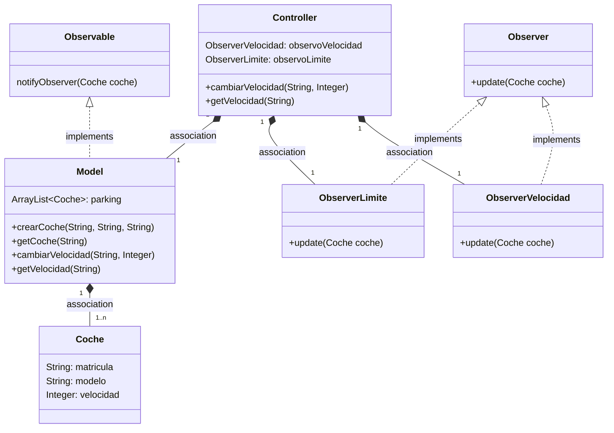
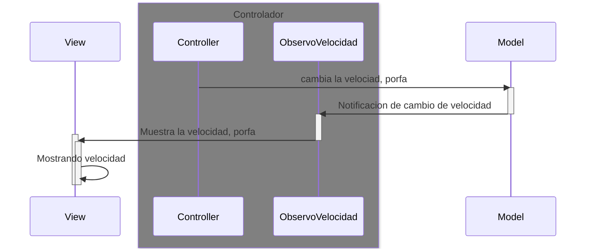
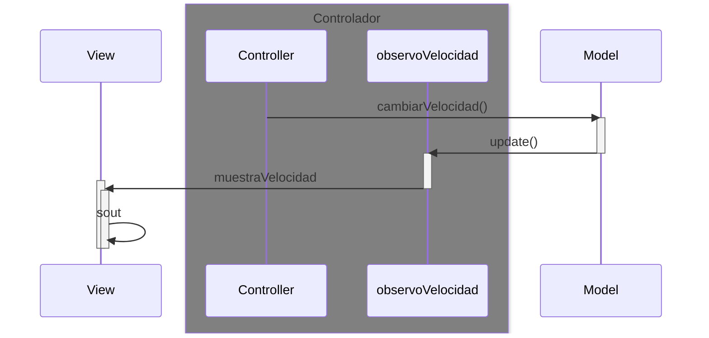
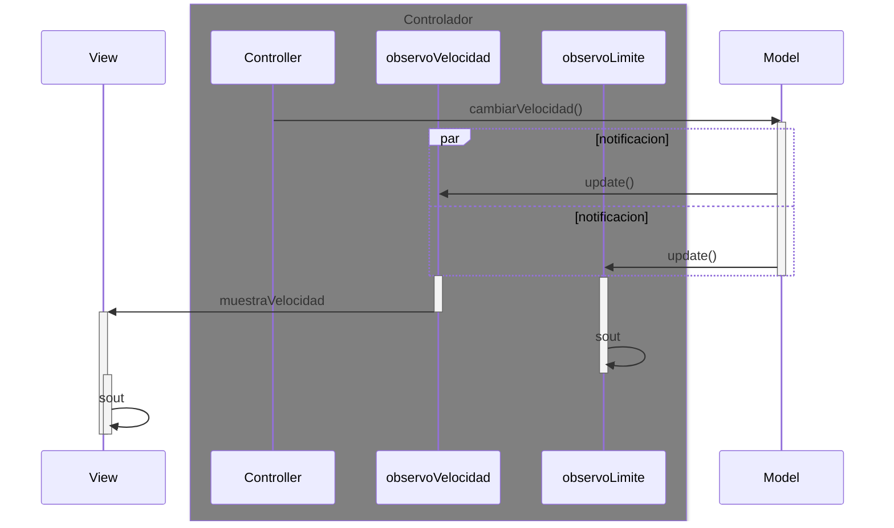

# Arquitectura MVC con Observer

En esta rama utilizaremos el patrón Observer

Los cambios de la velocidad que se hagan en el model
serán observados por el Controller

Para notificar a los observadores:

* Notificamos a los observadores `notifyObservers(valor)`

* se *dispara* en todos los observadores el método `update()`

---
## Diagrama de clases:

---

## Diagrama de Secuencia

Que ocurre cuando se cambia la velocidad

El mismo diagrama con los nombres de los métodos

Si sumamos otro observador (que vigile el limite de velocidad), entonces el `update()` será en paralelo (**par**)

a todos los Observadores

---
## Pasos para la configuración

1. Model
   * Implementar `Observable` en `Model`
   * En el método en donde ocurra el cambio, notificamos a los observadores con:
     * notifyObserver(valor)
2. Crear una clase para cada observador, que implementa la interface `Observer`
    * definir el método `update()`
3. Controller
    * Instanciar el observer, definido en el punto anterior
    * Añadir este observer al observable con `addObserver()` en el `Model`
